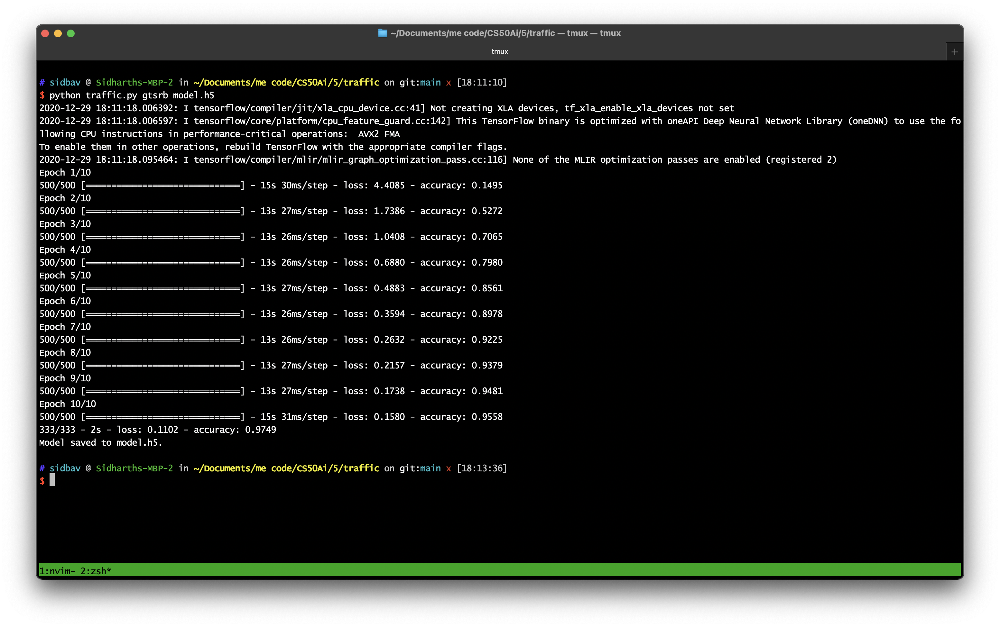

# Traffic

Initially when I was generating the neural network for the different traffic
signs, I had an convolution layer 64 filters and a kernel size of 3x3. This was
followed by a max pooling filter with size 2x2. Afterwards I flatten the input,
which was followed by two hidden layers, the first with 256 layers, and the
second with 128 layers. I had had a dropout rate of 50%. This was followed by
the output layer, which has 43 Nodes. When I ran these results, they gave me an
accuracy of about 95% on the test data, and 87% on the training data. This was
quite impressive, but I decided to try some better results.

I added a second convolution and pooling layer. The convolution layer had the
same kernel filter size, but had 32 filters, and the pooling filter was the same
as before. This resulted in a similar accuracy on the tested data, but about 89%
accuracy on the training data. I decided to change the number of preceptrons in
the second hidden layer, increasing it from 128 to 256. This increased the
accuracy of the testing data to 97.5%, and the training data accuracy to 95.58%.
I decided to try and decrease the dropout rate to 40%, however, this lead to
similar results as before, so I decided to stay previous model.

So the final neural network I ended up using is:
- Convolution Layer with 64 filters, 3x3 size
- Max Pooling Filter of 2x2 size
- Convolution Layer with 32 filters, 3x3 size
- Max Pooling Filter of 2x2 size
- Flattening Layer
- Hidden Layer with 256 Preceptrons
- Hidden Layer with 256 Preceptrons
- Output Layer with 43 Nodes

Note: The videos shows slightly different results that than ones I have written
about (did not record while testing) I have included a screenshot of the results
I obtained when using the model described above.

